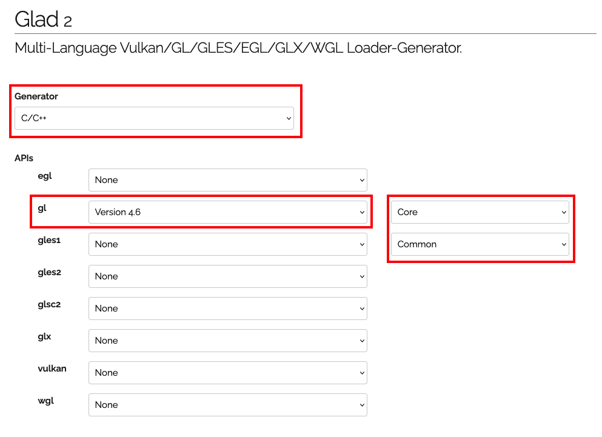
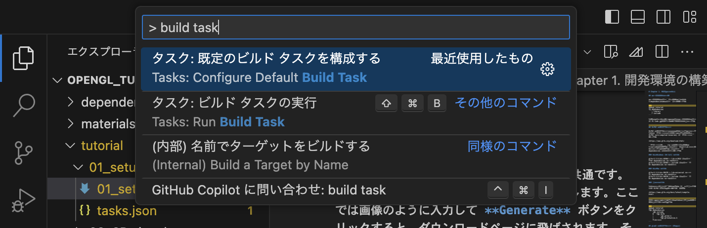
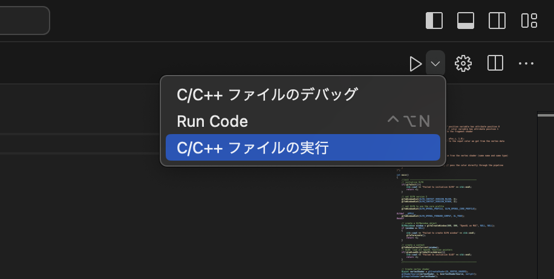
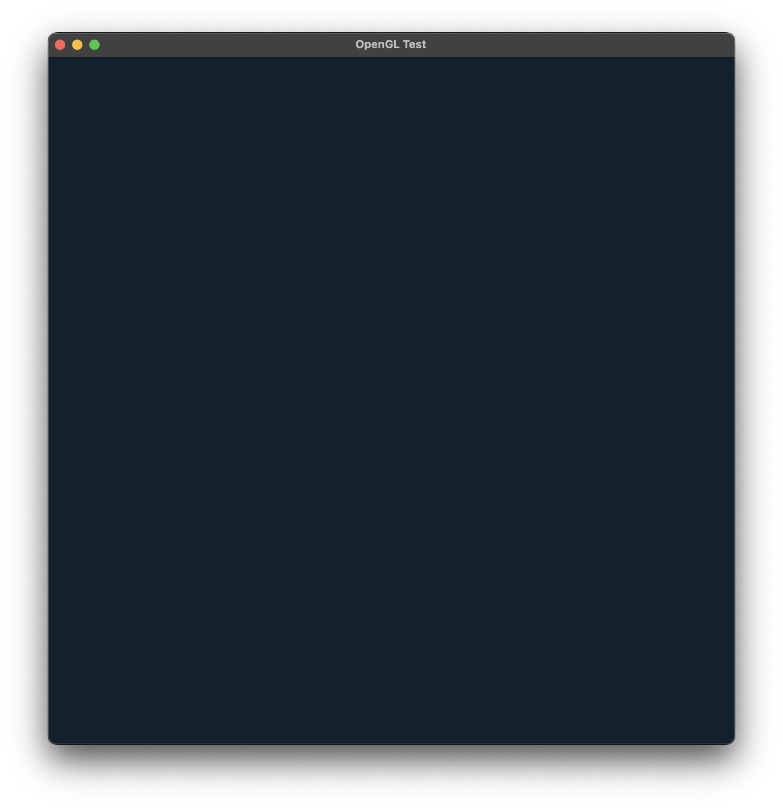

# Chapter 1. 開発環境の構築

OpenGL のプログラムを実行するための開発環境を準備します。
ここでは、VSCode上で実行できるようなプロジェクトフォルダを作成していきます。OpenGL周辺のライブラリにはたくさんの種類がありますが、ここではできるだけシンプルに、かつ [OpenGL Course (JP)](https://tatsy.github.io/OpenGLCourseJP/) や [OpenGL Tutorial (日本語訳版)](https://www.opengl-tutorial.org/jp/) のプログラムが動かせるような構成として、

- GLFW 3 (ウィンドウの作成など)
- glad 2 (OpenGLのローディングライブラリ)
- GLM (OpenGLの線形代数ライブラリ)

をインストールします。

### 環境要件

- C/C++ の開発環境 (GCC, Clangなど) がインストールされていること。
- Visual Studio Code がインストールされていること。

筆者は Mac/Linux ユーザーです。Windows のセットアップ方法についても一応記載しますが、あまり自信がないです。

## プロジェクトの作成

プロジェクトフォルダを作成し、その下に「dependencies」フォルダを作成します。

```
opengl_tutorial
└─ dependencies
   ├ library
   └ include
```

以降のチュートリアルでは、このプロジェクトフォルダを VS Code で開いて作業していくことになります。


## GLFW3 のインストール

GLFW3 のインストール方法は、OSによって異なります。
以下のダウンロードページから、自分のOSに合った GLFW3 (pre-compiled binaries) をダウンロードします。

<https://www.glfw.org/download.html>

ダウンロードされた zip ファイルを展開し、「imclude」という名前のフォルダと、「lib-****(OSによります)」という名前のフォルダを dependencies の下にコピーします。

### 例：Windows (64 bit) の場合

glfw-3.3.8.bin.WIN64 > lib-mingw-w64 をフォルダごと dependencies の中にコピー  
glfw-3.3.8.bin.WIN64 > include をフォルダごと dependencies の中にコピー

### 例：Mac の場合

glfw-3.3.8.bin.MACOS > lib-universal の中身を dependencies の中にコピー  
glfw-3.3.8.bin.MACOS > include をフォルダごと dependencies の中にコピー

### その他の場合

以下のページなどを参考に、CMake を使ってソースから直接 GLFW3 をコンパイルしてください。

<https://www.glfw.org/docs/latest/compile.html>


ここまでの作業が完了すると、以下のようなファイル構成になっているはずです。

```
opengl_tutorial
└── dependencies
    ├── include
    │   └── GLFW
    |       ├── glfw3.h
    |       └── glfw3native.h
    └lib-****
```

## glad2 のインストール

glad2 のインストール方法は、どのOSでも共通です。
以下のサイトから、glad2 をダウンロードします。ここでは画像のように入力して **Generate** ボタンをクリックすると、ダウンロードページに飛ばされます。そこで「glad.zip」をクリックするとダウンロードが始まります。



ダウンロードした「glad.zip」を展開し、その中にある  
glad > src > gl.c をプロジェクトフォルダ (opengl_tutorial) へ、  
glad > include の中身 (glad, KHR) を dependencies > include の中へ、  
それぞれコピーします。ここまでの作業が完了すると、以下のようなファイル構成になっているはずです。

```
opengl-tutorial
├── dependencies
│   ├── include
│   │   ├── GLFW
│   │   │   ├── glfw3.h
│   │   │   └── glfw3native.h
│   │   ├── KHR
│   │   │   └── khrplatform.h
│   │   └── glad
│   │       └── gl.h
│   └── lib-****
│       ├── libglfw3.***
│       └── ...
└── gl.c
```

## GLM のインストール

GLM のインストール方法は、どのOSでも共通です。
[GitHubのリポジトリ](<https://github.com/g-truc/glm#readme>)から [Latest Release](https://github.com/g-truc/glm/releases/latest) を選択し、最新版の GLM をダウンロードします。
zipファイルを展開し、その中にある  
glm > glm をフォルダごと dependencies > include にコピーします。

ここまでの作業が完了すると、以下のようなファイル構成になっているはずです。

```
opengl-tutorial
├── dependencies
│   ├── include
│   │   ├── GLFW
│   │   │   ├── glfw3.h
│   │   │   └── glfw3native.h
│   │   ├── KHR
│   │   │   └── khrplatform.h
│   │   ├── glad
│   │   │   └── gl.h
│   │   └── glm
│   │       ├── glm.hpp
│   │       └── ...
│   └── lib-****
│       ├── libglfw3.***
│       └── ...
└── gl.c
```


これにて OpenGL 関連パッケージのインストールは完了です。

## VS Code の設定

VS Code で既定のビルドタスクを構成していきます。コマンドパレットで `>` を入力し、Configure Default Build Task...を選択します。



「.vscode」というフォルダとともに、「tasks.json」というファイルが作成されるので、OSに合わせてこれを次のように編集します (`args:` の内容が重要です)。

### 例：Windows の場合

<details> <summary>tasks.json</summary>

```json:
{
	"version": "2.0.0",
	"tasks": [
		{
			"type": "cppbuild",
			"label": "C/C++: build active file (Windows)",
			"command": "c++",
			"args": [
				"-std=c++17",
				"-fcolor-diagnostics",
				"-fansi-escape-codes",
				"-Wall",
				"-g",

				"-I${workspaceFolder}/dependencies/include",
				"-L${workspaceFolder}/dependencies/lib-mingw-w64", //for Windows
				
				"${file}",
				"${workspaceFolder}/gl.c",
				"${workspaceFolder}/dependencies/lib-mingw-w64/libglfw3dll.a", //for MacOS
				"-rpath",
				"${workspaceFolder}/dependencies/lib-mingw-w64",

				"-o",
				"${fileDirname}/${fileBasenameNoExtension}.out"
			],
			"options": {
				"cwd": "${fileDirname}"
			},
			"problemMatcher": [
				"$gcc"
			],
			"group": {
				"kind": "build",
				"isDefault": true
			}
		}
	]
}
```

</details>

### 例：Mac の場合

<details> <summary>tasks.json</summary>

```json:
{
	"version": "2.0.0",
	"tasks": [
		{
			"type": "cppbuild",
			"label": "C/C++: build active file (Mac)",
			"command": "c++",
			"args": [
				"-std=c++17",
				"-fcolor-diagnostics",
				"-fansi-escape-codes",
				"-Wall",
				"-g",

				"-I${workspaceFolder}/dependencies/include",
				"-L${workspaceFolder}/dependencies/lib-universal", //for MacOS
				
				"${file}",
				"${workspaceFolder}/gl.c",
				"${workspaceFolder}/dependencies/lib-universal/libglfw.3.dylib", //for MacOS
				"-rpath",
				"${workspaceFolder}/dependencies/lib-universal",

				"-o",
				"${fileDirname}/${fileBasenameNoExtension}.out",

				//for MacOS
				"-framework",
				"OpenGL",
				"-framework",
				"Cocoa",
				"-framework",
				"IOKit",
				"-framework",
				"CoreVideo",
				"-framework",
				"CoreFoundation",
				"-Wno-deprecated",
			],
			"options": {
				"cwd": "${fileDirname}"
			},
			"problemMatcher": [
				"$gcc"
			],
			"group": {
				"kind": "build",
				"isDefault": true
			}
		}
	]
}
```

</details>


## テストコードの実行

ここまでの作業が完了すれば、OpenGL のコードを実行することができます。
プロジェクトフォルダ内に「main.cpp」を作成し、以下のテストコードを実行してみましょう。

```cpp:main.cpp
#include <glad/gl.h>
#include <GLFW/glfw3.h>
#include <glm/glm.hpp>

#include <iostream>

int main()
{
	// GLFWの初期化
	glfwInit();

	// GLFWのバージョンを指定
	glfwWindowHint(GLFW_CONTEXT_VERSION_MAJOR, 3);
	glfwWindowHint(GLFW_CONTEXT_VERSION_MINOR, 3);

	// GLFWのプロファイルを指定
	glfwWindowHint(GLFW_OPENGL_PROFILE, GLFW_OPENGL_CORE_PROFILE);

#ifdef __APPLE__
    glfwWindowHint(GLFW_OPENGL_FORWARD_COMPAT, GL_TRUE);
#endif

	// Windowを作成 
	GLFWwindow* window = glfwCreateWindow(800, 800, "OpenGL Test", NULL, NULL);
	if (window == NULL)
	{
		std::cout << "Failed to create GLFW window" << std::endl;
		glfwTerminate();
		return -1;
	}

	// コンテキストの作成
	glfwMakeContextCurrent(window);
	// GLADをロードしてOpenGLの設定を行う
	gladLoadGL(glfwGetProcAddress);
    


	glViewport(0, 0, 800, 800);
	glClearColor(0.07f, 0.13f, 0.17f, 1.0f);
	glClear(GL_COLOR_BUFFER_BIT);
	glfwSwapBuffers(window);


	while (!glfwWindowShouldClose(window))
	{
		glfwPollEvents();
	}

	glfwDestroyWindow(window);
	glfwTerminate();

	return 0;
}
```

実行する際には、VSCodeからコンパイル・実行を行います。



ビルドが正常に完了し、空のウィンドウが表示されれば成功です。




お疲れ様でした。

## 参考URL

- <https://zenn.dev/k41531/articles/aa375915ce4e8c>
- <https://medium.com/@vivekjha92/setup-opengl-with-vs-code-82852c653c43>
- <https://tatsy.github.io/OpenGLCourseJP/setup/glad/>
